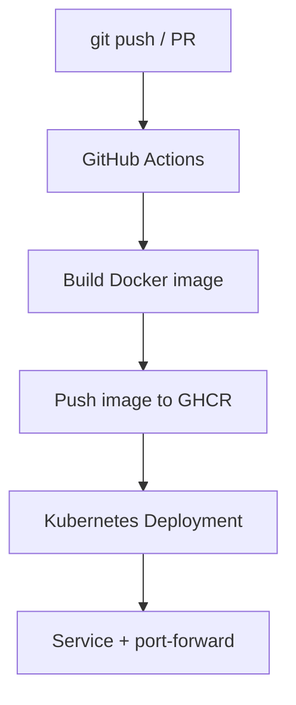

This repo is a practical, portfolio-ready **end-to-end pipeline** you can run without paying for cloud compute:

- **Code**: a minimal Flask API (`app/main.py`)
- **Container**: a Docker image built from `app/Dockerfile`
- **CI/CD**: GitHub Actions builds and publishes to **GitHub Container Registry (GHCR)** (`.github/workflows/ci-cd.yaml`)
- **Deploy**: Kubernetes `Deployment` + `Service` with probes and limits (`k8s/*.yaml`)
- **IaC (optional)**: Terraform creates the Kubernetes namespace (`terraform/*.tf`)

The goal is to demonstrate the real flow clients/interviewers expect: **repo → CI build → registry → runnable deployment**.

## What you’re building (high level)



## Prerequisites

- **Git** and a GitHub repo
- **Docker** (or another container runtime)
- **kubectl**
- **One local Kubernetes option**
  - **minikube**, or
  - **kind**
- **Terraform** (optional, only if you want the IaC section)

## Repo layout

```text
.
├── app
│   ├── Dockerfile
│   ├── main.py
│   └── requirements.txt
├── k8s
│   ├── namespace.yaml
│   └── deployment.yaml
├── terraform
│   ├── main.tf
│   └── k8s.tf
└── .github
    └── workflows
        └── ci-cd.yaml
```

## 1) The application: minimal, probe-friendly HTTP service

The app exposes:

- `/` — returns service metadata (useful for “is it running?” checks)
- `/health` — liveness probe endpoint
- `/ready` — readiness probe endpoint

`app/main.py`:

```python
import os
from flask import Flask, jsonify

app = Flask(__name__)

VERSION = os.environ.get("APP_VERSION", "1.0.0")
ENV = os.environ.get("ENV", "dev")

@app.route("/")
def index():
    return jsonify({
        "service": "demo-app",
        "version": VERSION,
        "env": ENV,
        "status": "ok",
    })

@app.route("/health")
def health():
    return jsonify({"status": "healthy"}), 200

@app.route("/ready")
def ready():
    return jsonify({"status": "ready"}), 200

if __name__ == "__main__":
    app.run(host="0.0.0.0", port=8080)
```

Dependencies stay intentionally small:

`app/requirements.txt`:

```text
flask>=3.0.0
```

## 2) Containerize it with Docker

This repo’s Dockerfile does a few “real world” basics:

- Uses a slim base image
- Runs as a **non-root** user
- Installs dependencies and keeps layers simple

`app/Dockerfile`:

```dockerfile
FROM python:3.12-slim AS runtime

WORKDIR /app

RUN adduser --disabled-password --gecos "" appuser

COPY requirements.txt .
RUN pip install --no-cache-dir -r requirements.txt && pip freeze > requirements.lock

COPY main.py .

USER appuser
EXPOSE 8080

ENV FLASK_APP=main.py
CMD ["python", "-m", "flask", "run", "--host=0.0.0.0", "--port=8080"]
```

Run it locally:

```bash
docker build -t demo-app:local ./app
docker run --rm -p 8080:8080 demo-app:local
curl -s http://localhost:8080 | jq .
```

If you don’t have `jq`, just open `http://localhost:8080` in a browser.

## 3) Deploy to Kubernetes (local cluster, zero cloud cost)

The Kubernetes manifests in this repo:

- Create a dedicated namespace: `k8s/namespace.yaml`
- Deploy 2 replicas with resource requests/limits and probes: `k8s/deployment.yaml`
- Expose as a ClusterIP `Service` (we’ll port-forward for local access)

### Start a cluster

Minikube:

```bash
minikube start
```

Kind:

```bash
kind create cluster --name demo
```

### Make the image available to the cluster

Kubernetes can’t pull `demo-app:local` from your laptop unless you load it into the cluster runtime.

**Option A: minikube (build directly into the minikube Docker daemon)**

```bash
eval "$(minikube docker-env)"
docker build -t demo-app:local ./app
```

**Option B: kind (load your locally-built image into kind)**

```bash
docker build -t demo-app:local ./app
kind load docker-image demo-app:local --name demo
```

### Apply manifests and test

```bash
kubectl apply -f k8s/namespace.yaml
kubectl apply -f k8s/deployment.yaml

kubectl get pods,svc -n demo-app
kubectl port-forward -n demo-app svc/demo-app 8080:80
```

Now hit:

```bash
curl -s http://localhost:8080/health
curl -s http://localhost:8080/ready
curl -s http://localhost:8080/
```

## 4) CI/CD: build and publish to GHCR with GitHub Actions

The workflow file is already in the repo:

`/.github/workflows/ci-cd.yaml`

It does the core CI/CD loop:

- Trigger on **push** and **pull_request**
- Build the Docker image
- Push to GHCR **only on push** (PRs build, but don’t publish)
- Tag images with:
  - the commit SHA (`type=sha`)
  - `latest` (only on your default branch)

### The GHCR “gotchas” you want to know

- **Package visibility**: for public repos, GHCR images are often public by default, but sometimes the package visibility needs to be explicitly set to public in GitHub UI (Package settings).
- **Lowercase image names**: GHCR image paths are safest when **fully lowercase** (`ghcr.io/<owner>/<image>`). If your org/user has uppercase characters, normalize to lowercase in the workflow.
- **PRs from forks**: secrets aren’t available, so publishing is typically skipped (this repo’s workflow already avoids pushing on PR events).

### Verify the image exists

After you push to `main`/`master`, go to your repo’s **Actions** tab, then check **Packages** for something like:

- `ghcr.io/<your-github-username>/demo-app:latest`
- `ghcr.io/<your-github-username>/demo-app:<git-sha>`

## 5) Deploy using the GHCR image (instead of local)

To deploy using the image produced by CI/CD, update the image in `k8s/deployment.yaml`:

```yaml
image: ghcr.io/YOUR_USERNAME/demo-app:latest
```

Then apply again:

```bash
kubectl apply -f k8s/deployment.yaml
```

### Private image? Create an imagePullSecret

If the package is private, Kubernetes will fail with `ImagePullBackOff`.

Create a registry secret (use a GitHub PAT with `read:packages`):

```bash
kubectl -n demo-app create secret docker-registry ghcr-pull \
  --docker-server=ghcr.io \
  --docker-username=YOUR_USERNAME \
  --docker-password=YOUR_PAT \
  --docker-email=YOUR_EMAIL
```

Then reference it in the Pod spec (`spec.template.spec.imagePullSecrets`):

```yaml
imagePullSecrets:
  - name: ghcr-pull
```

## 6) Optional IaC: Terraform (Kubernetes provider)

If you want an Infrastructure-as-Code checkbox in the project, the repo includes Terraform that creates the namespace:

- `terraform/main.tf` — provider setup
- `terraform/k8s.tf` — `kubernetes_namespace` resource

Run it against your local cluster kubeconfig:

```bash
cd terraform
terraform init
terraform plan
terraform apply
```

This is intentionally “small but real”: it demonstrates Terraform workflow and state management without needing AWS/GCP.

## Troubleshooting (the common failures)

### `ImagePullBackOff`

- You pointed Kubernetes at `ghcr.io/...` but the image/package is private
- You didn’t create an `imagePullSecret`, or didn’t wire it into the Deployment
- The tag doesn’t exist (`latest` only appears on pushes to the default branch)

### Pod never becomes Ready

- Check probes are reachable from inside the cluster:

```bash
kubectl -n demo-app describe pod <pod-name>
kubectl -n demo-app logs deploy/demo-app
```

### Kind can’t see your local image

- You built the image locally, but forgot:

```bash
kind load docker-image demo-app:local --name demo
```

## Next steps (if you want to evolve this into “production-like”)

- Add lint/test to CI (e.g. `ruff`, `pytest`)
- Add vulnerability scanning (Trivy) and/or SBOM generation
- Add an Ingress (and TLS via cert-manager) for a real hostname
- Add GitOps (Argo CD or Flux) so deploys happen via manifests, not imperative kubectl
- Add a separate deploy job for a real cluster (self-hosted runner or GitOps sync)

## Copy/paste links for dev.to

- **Repo**: `<YOUR_REPO_URL>`
- **Tags**: `devops` `cicd` `githubactions` `docker` `kubernetes` `ghcr` `terraform`

# Build an End-to-End DevOps Pipeline (CI/CD + Docker + Kubernetes) — Zero Cloud Cost

**A practical, portfolio-ready pipeline that matches what clients look for on Upwork and other freelance platforms.**

---

## Why this pipeline?

If you’ve browsed DevOps jobs on Upwork, you keep seeing the same stack: **CI/CD (GitHub Actions or Jenkins), Docker, Kubernetes, and sometimes Terraform.** Clients want to see that you can take code from a repo and get it running in a container, then deploy it in a “production-like” way.

This article walks through a **single, end-to-end project** you can run **entirely for free** — no AWS/GCP credits, no paid servers. You’ll get:

- A small **app** (Python/Flask) in a **Docker** image  
- A **GitHub Actions** workflow that builds the image and pushes it to **GitHub Container Registry (GHCR)**  
- **Kubernetes** manifests to run the app (locally with minikube/kind, or in any cluster)  
- Optional **Terraform** to manage a bit of Kubernetes (namespace) so you can show IaC

By the end, you’ll have a repo you can point to in proposals and interviews: *“Here’s my end-to-end pipeline: code → build → registry → deploy.”*

---

## What we’re building (high level)

```bash
GitHub repo (code)
       ↓
GitHub Actions (on push/PR)
       ↓
Build Docker image → Push to GHCR
       ↓
Kubernetes (Deployment + Service)
       ↓
App running in cluster (or locally via minikube/kind)
```

Everything up to “push to GHCR” works with a free GitHub account. Deployment can be local (minikube/kind) or any cluster you have.

---

## 1. The application

Keep the app minimal so the focus stays on the pipeline. A single HTTP service with a root route and a health check is enough.

**`app/main.py`** (Flask):

```python
import os
from flask import Flask, jsonify

app = Flask(__name__)
VERSION = os.environ.get("APP_VERSION", "1.0.0")
ENV = os.environ.get("ENV", "dev")

@app.route("/")
def index():
    return jsonify({
        "service": "demo-app",
        "version": VERSION,
        "env": ENV,
        "status": "ok",
    })

@app.route("/health")
def health():
    return jsonify({"status": "healthy"}), 200

@app.route("/ready")
def ready():
    return jsonify({"status": "ready"}), 200

if __name__ == "__main__":
    app.run(host="0.0.0.0", port=8080)
```

**`app/requirements.txt`**:

```sh
flask>=3.0.0
```

The app listens on port **8080** and exposes `/`, `/health`, and `/ready`. We’ll use `/health` and `/ready` later for Kubernetes probes.

---

## 2. Docker image

A small, multi-stage-style Dockerfile keeps the image lean and shows good practice. We use a non-root user and pin dependencies.

**`app/Dockerfile`**:

```dockerfile
FROM python:3.12-slim AS runtime

WORKDIR /app
RUN adduser --disabled-password --gecos "" appuser

COPY requirements.txt .
RUN pip install --no-cache-dir -r requirements.txt
COPY main.py .

USER appuser
EXPOSE 8080
ENV FLASK_APP=main.py
CMD ["python", "-m", "flask", "run", "--host=0.0.0.0", "--port=8080"]
```

Build and run locally:

```bash
docker build -t demo-app ./app
docker run -p 8080:8080 demo-app
# Open http://localhost:8080
```

You should see JSON with `service`, `version`, and `env`. This same image will later be built by GitHub Actions and pushed to GHCR.

---

## 3. GitHub Actions CI/CD

We want the pipeline to:

- **On every push/PR:** build the image (and optionally run tests/linters).
- **On push to main (or master):** tag the image and push it to GHCR.

GitHub gives you a **GITHUB_TOKEN** with `packages: write` for the repo, so you don’t need to create a personal access token for a **public** repo.

**`.github/workflows/ci-cd.yaml`**:

```yaml
name: CI/CD Pipeline

on:
  push:
    branches: [main, master]
  pull_request:
    branches: [main, master]

env:
  REGISTRY: ghcr.io

jobs:
  build-and-push:
    runs-on: ubuntu-latest
    permissions:
      contents: read
      packages: write

    steps:
      - name: Checkout
        uses: actions/checkout@v4

      - name: Set up Docker Buildx
        uses: docker/setup-buildx-action@v3

      - name: Log in to GHCR
        uses: docker/login-action@v3
        with:
          registry: ${{ env.REGISTRY }}
          username: ${{ github.actor }}
          password: ${{ secrets.GITHUB_TOKEN }}

      - name: Extract metadata (tags, labels)
        id: meta
        uses: docker/metadata-action@v5
        with:
          images: ${{ env.REGISTRY }}/${{ github.repository_owner }}/demo-app
          tags: |
            type=sha,prefix=
            type=raw,value=latest,enable=${{ github.ref == 'refs/heads/main' || github.ref == 'refs/heads/master' }}

      - name: Build and push Docker image
        uses: docker/build-push-action@v5
        with:
          context: ./app
          file: ./app/Dockerfile
          push: ${{ github.event_name != 'pull_request' }}
          tags: ${{ steps.meta.outputs.tags }}
          labels: ${{ steps.meta.outputs.labels }}
          cache-from: type=gha
          cache-to: type=gha,mode=max
```

Notes:

- **`push: ${{ github.event_name != 'pull_request' }}`** — push only on push events (not on PRs), so PRs only build.
- **Image name** — `ghcr.io/<repository_owner>/demo-app`. For a repo under your user, that’s `ghcr.io/YOUR_USERNAME/demo-app`.
- **Tags** — one tag from git SHA, and `latest` only for the default branch.
- **Cache** — `type=gha` uses GitHub’s cache and speeds up repeated builds.

After you push this workflow to a **public** repo and push to `main`, the Actions tab will show the run and the new image will appear under **Packages** (e.g. `ghcr.io/your-username/demo-app:latest`).

---

## 4. Kubernetes manifests

We’ll deploy the app as a **Deployment** with two replicas and a **Service**. The image can be either:

- **Local:** `demo-app:local` (after `docker build -t demo-app:local ./app` and, if using minikube, `eval $(minikube docker-env)` and rebuild), or  
- **GHCR:** `ghcr.io/YOUR_USERNAME/demo-app:latest` (after making the package public if the cluster is not in GitHub).

**`k8s/namespace.yaml`**:

```yaml
apiVersion: v1
kind: Namespace
metadata:
  name: demo-app
  labels:
    app.kubernetes.io/name: demo-app
```

**`k8s/deployment.yaml`** (Deployment + Service):

```yaml
apiVersion: apps/v1
kind: Deployment
metadata:
  name: demo-app
  namespace: demo-app
  labels:
    app: demo-app
spec:
  replicas: 2
  selector:
    matchLabels:
      app: demo-app
  template:
    metadata:
      labels:
        app: demo-app
    spec:
      containers:
        - name: app
          image: demo-app:local   # or ghcr.io/YOUR_USERNAME/demo-app:latest
          imagePullPolicy: IfNotPresent
          ports:
            - containerPort: 8080
              name: http
          env:
            - name: ENV
              value: "production"
            - name: APP_VERSION
              value: "1.0.0"
          resources:
            requests:
              cpu: 50m
              memory: 64Mi
            limits:
              cpu: 200m
              memory: 128Mi
          livenessProbe:
            httpGet:
              path: /health
              port: 8080
            initialDelaySeconds: 5
            periodSeconds: 10
          readinessProbe:
            httpGet:
              path: /ready
              port: 8080
            initialDelaySeconds: 3
            periodSeconds: 5
---
apiVersion: v1
kind: Service
metadata:
  name: demo-app
  namespace: demo-app
spec:
  type: ClusterIP
  ports:
    - port: 80
      targetPort: 8080
      protocol: TCP
      name: http
  selector:
    app: demo-app
```

Apply and test locally (minikube example):

```bash
kubectl apply -f k8s/namespace.yaml
kubectl apply -f k8s/deployment.yaml
kubectl get pods,svc -n demo-app
kubectl port-forward -n demo-app svc/demo-app 8080:80
# Open http://localhost:8080
```

This gives you a full path: **code → Docker → K8s**, with health checks and resource limits.

---

## 5. Optional: Terraform for Kubernetes

Many Upwork jobs ask for **Infrastructure as Code**. You can add a small Terraform setup that creates the **namespace** (and optionally more resources) so you can say: “I use Terraform to manage part of the Kubernetes config.”

Example with the **Kubernetes provider** (no cloud account):

**`terraform/main.tf`**:

```hcl
terraform {
  required_version = ">= 1.0"
  required_providers {
    kubernetes = {
      source  = "hashicorp/kubernetes"
      version = "~> 2.23"
    }
  }
}

provider "kubernetes" {
  config_path = var.kube_config_path
}

variable "kube_config_path" {
  type    = string
  default = "~/.kube/config"
}
```

**`terraform/k8s.tf`**:

```hcl
resource "kubernetes_namespace" "demo_app" {
  metadata {
    name   = "demo-app"
    labels = { "app.kubernetes.io/name" = "demo-app" }
  }
}
```

Then:

```bash
cd terraform
terraform init
terraform plan
terraform apply
```

Your kubeconfig (e.g. from minikube or kind) must point to a running cluster. This shows you can combine **Terraform + Kubernetes** without spending money.

---

## 6. Running the full pipeline locally (no cloud)

1. **Clone the repo** (or use the same layout locally).
2. **Build image and run with Docker** (optional sanity check):

   ```bash
   docker build -t demo-app ./app
   docker run -p 8080:8080 demo-app
   ```

3. **Start a cluster** (minikube or kind):

   ```bash
   minikube start
   # or: kind create cluster --name demo
   ```

4. **Load local image into cluster** (minikube):

   ```bash
   eval $(minikube docker-env)
   docker build -t demo-app:local ./app
   ```

5. **Deploy:**

   ```bash
   kubectl apply -f k8s/
   kubectl port-forward -n demo-app svc/demo-app 8080:80
   ```

6. **Use GHCR image instead:**  
   Set in `k8s/deployment.yaml`: `image: ghcr.io/YOUR_USERNAME/demo-app:latest`, set `imagePullPolicy: Always` (or omit for default), and ensure the cluster can pull from GHCR (e.g. public package or imagePullSecret).

No cloud VM or paid service is required.

---

## 7. What this gives you for Upwork and interviews

- **CI/CD:** GitHub Actions builds and pushes on every push; you can extend with tests or security scans.  
- **Containers:** Dockerfile with a non-root user, small base, and clear CMD.  
- **Registry:** GHCR is free for public images and integrates with Actions.  
- **Kubernetes:** Real Deployment + Service with probes and limits.  
- **IaC (optional):** Terraform managing a namespace (or more) shows you can codify infra.

You can say: *“I have an end-to-end pipeline: GitHub repo → GitHub Actions → Docker → GHCR → Kubernetes, and I can run it locally or in any cluster.”*

---

## 8. Possible next steps

- Add a **lint/test** step in the workflow (e.g. `ruff` or `pytest`).  
- Add an **Ingress** (or IngressRoute) and TLS (e.g. cert-manager) for a “production-like” URL.  
- Use **Argo CD** or a second workflow to deploy from GHCR to a cluster (e.g. on push to main).  
- Add **Terraform** for a cloud provider (e.g. EKS or GKE) when you have credentials.

---

## Summary

You now have a single repo that demonstrates:

1. A small **app** in **Docker**.  
2. **GitHub Actions** building and pushing the image to **GHCR**.  
3. **Kubernetes** manifests to run the app with health checks and resource limits.  
4. Optional **Terraform** for Kubernetes namespace (or more).

All of this can be run **end-to-end for free** (GitHub + local cluster). Use it as a portfolio project and as a base to expand when clients ask for CI/CD, Docker, Kubernetes, or Terraform.

If you want the full project layout and files in one place, check the repo: [your-repo-url]. You can clone it and run the pipeline locally in under 10 minutes.

---

**Tags (for dev.to / Hashnode):**  
`devops` `cicd` `github-actions` `docker` `kubernetes` `terraform` `portfolio` `tutorial`

**Cover / SEO:**  
“Build an end-to-end DevOps pipeline with GitHub Actions, Docker, and Kubernetes — no cloud cost. Step-by-step tutorial and sample repo for your portfolio.”
