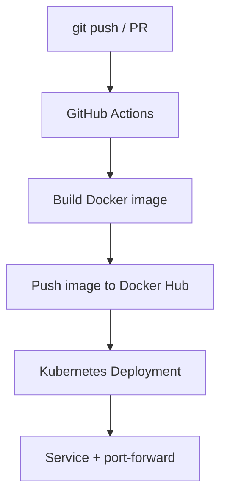
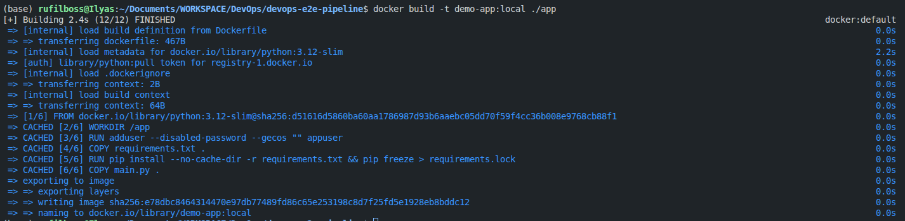
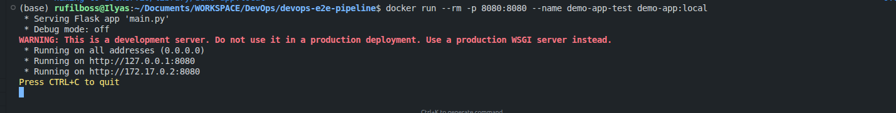
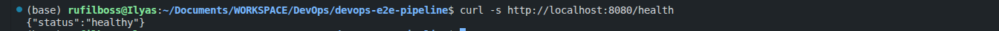
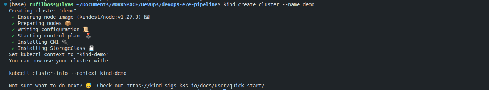
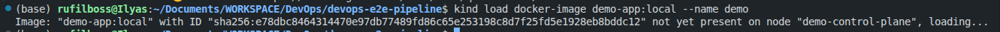
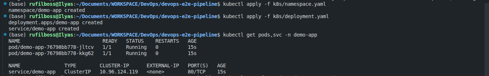
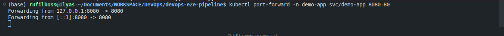

This repo is a practical, portfolio-ready **end-to-end pipeline** you can run without paying for cloud compute:

- **Code**: a minimal Flask API (`app/main.py`)
- **Container**: a Docker image built from `app/Dockerfile`
- **CI/CD**: GitHub Actions builds and publishes to **Docker Hub** (`.github/workflows/ci-cd.yaml`)
- **Deploy**: Kubernetes `Deployment` + `Service` with probes and limits (`k8s/*.yaml`)
- **IaC (optional)**: Terraform creates the Kubernetes namespace (`terraform/*.tf`)

The goal is to demonstrate the real flow clients/interviewers expect: **repo → CI build → registry → runnable deployment**.

## What you’re building (high level)



## Prerequisites

- **Git** and a GitHub repo
- **Docker** (or another container runtime)
- **kubectl**
- **One local Kubernetes option**
  - **minikube**, or
  - **kind**
- **Terraform** (optional, only if you want the IaC section)

## Repo layout

```text
.
├── app
│   ├── Dockerfile
│   ├── main.py
│   └── requirements.txt
├── k8s
│   ├── namespace.yaml
│   └── deployment.yaml
├── terraform
│   ├── main.tf
│   └── k8s.tf
└── .github
    └── workflows
        └── ci-cd.yaml
```

## 1) The application: minimal, probe-friendly HTTP service

The app exposes:

- `/` — returns service metadata (useful for “is it running?” checks)
- `/health` — liveness probe endpoint
- `/ready` — readiness probe endpoint

`app/main.py`:

```python
import os
from flask import Flask, jsonify

app = Flask(__name__)

VERSION = os.environ.get("APP_VERSION", "1.0.0")
ENV = os.environ.get("ENV", "dev")

@app.route("/")
def index():
    return jsonify({
        "service": "demo-app",
        "version": VERSION,
        "env": ENV,
        "status": "ok",
    })

@app.route("/health")
def health():
    return jsonify({"status": "healthy"}), 200

@app.route("/ready")
def ready():
    return jsonify({"status": "ready"}), 200

if __name__ == "__main__":
    app.run(host="0.0.0.0", port=8080)
```

Dependencies stay intentionally small:

`app/requirements.txt`:

```text
flask>=3.0.0
```

## 2) Containerize it with Docker

This repo’s Dockerfile does a few “real world” basics:

- Uses a slim base image
- Runs as a **non-root** user
- Installs dependencies and keeps layers simple

`app/Dockerfile`:

```dockerfile
FROM python:3.12-slim AS runtime

WORKDIR /app

RUN adduser --disabled-password --gecos "" appuser

COPY requirements.txt .
RUN pip install --no-cache-dir -r requirements.txt && pip freeze > requirements.lock

COPY main.py .

USER appuser
EXPOSE 8080

ENV FLASK_APP=main.py
CMD ["python", "-m", "flask", "run", "--host=0.0.0.0", "--port=8080"]
```

Run it locally:

```bash
docker build -t demo-app:local ./app
docker run --rm -p 8080:8080 demo-app:local
curl -s http://localhost:8080 | jq .
```

If you don’t have `jq`, just open `http://localhost:8080` in a browser.

Example Docker build output:



Example `docker run` output:



Example `curl` output against `/health`:



Example `curl` output against `/`:


## 3) Deploy to Kubernetes (local cluster, zero cloud cost)

The Kubernetes manifests in this repo:

- Create a dedicated namespace: `k8s/namespace.yaml`
- Deploy 2 replicas with resource requests/limits and probes: `k8s/deployment.yaml`
- Expose as a ClusterIP `Service` (we’ll port-forward for local access)

### Start a cluster

Minikube:

```bash
minikube start
```

Kind:

```bash
kind create cluster --name demo
```

Example kind cluster creation:



### Make the image available to the cluster

Kubernetes can’t pull `demo-app:local` from your laptop unless you load it into the cluster runtime.

**Option A: minikube (build directly into the minikube Docker daemon)**

```bash
eval "$(minikube docker-env)"
docker build -t demo-app:local ./app
```

**Option B: kind (load your locally-built image into kind)**

```bash
docker build -t demo-app:local ./app
kind load docker-image demo-app:local --name demo
```

Example kind image load:



### Apply manifests and test

```bash
kubectl apply -f k8s/namespace.yaml
kubectl apply -f k8s/deployment.yaml

kubectl get pods,svc -n demo-app
kubectl port-forward -n demo-app svc/demo-app 8080:80
```

Example `kubectl apply` and `kubectl get`:



Example `kubectl port-forward`:



Now hit:

```bash
curl -s http://localhost:8080/health
curl -s http://localhost:8080/ready
curl -s http://localhost:8080/
```

## 4) CI/CD: build and publish to Docker Hub with GitHub Actions

The workflow file is already in the repo:

`/.github/workflows/ci-cd.yaml`

It does the core CI/CD loop:

- Trigger on **push** and **pull_request**
- Build the Docker image
- Push to Docker Hub **only on push** (PRs build, but don’t publish)
- Tag images with:
  - the commit SHA (`type=sha`)
  - `latest` (only on your default branch)

### Docker Hub setup

1. Create a **Docker Hub** account (if you don’t have one) and a repository called `demo-app`.
2. In Docker Hub, generate an **access token**.
3. In your GitHub repo → **Settings → Secrets and variables → Actions**, create:
   - `DOCKERHUB_USERNAME` — your Docker Hub username
   - `DOCKERHUB_TOKEN` — the access token

The workflow will log in to Docker Hub with those secrets and push images to:

- `docker.io/asruf/demo-app:<git-sha>`
- `docker.io/asruf/demo-app:latest` (only on the default branch)

## 5) Deploy using the Docker Hub image (instead of local)

To deploy using the image produced by CI/CD, update the image in `k8s/deployment.yaml` (already set in this repo):

```yaml
image: docker.io/asruf/demo-app:latest
```

Then apply again:

```bash
kubectl apply -f k8s/deployment.yaml
```

## 6) Optional IaC: Terraform (Kubernetes provider)

If you want an Infrastructure-as-Code checkbox in the project, the repo includes Terraform that creates the namespace:

- `terraform/main.tf` — provider setup
- `terraform/k8s.tf` — `kubernetes_namespace` resource

Run it against your local cluster kubeconfig:

```bash
cd terraform
terraform init
terraform plan
terraform apply
```

This is intentionally “small but real”: it demonstrates Terraform workflow and state management without needing AWS/GCP.

## Troubleshooting (the common failures)

### `ImagePullBackOff`

- You pointed Kubernetes at `ghcr.io/...` but the image/package is private
- You didn’t create an `imagePullSecret`, or didn’t wire it into the Deployment
- The tag doesn’t exist (`latest` only appears on pushes to the default branch)

### Pod never becomes Ready

- Check probes are reachable from inside the cluster:

```bash
kubectl -n demo-app describe pod <pod-name>
kubectl -n demo-app logs deploy/demo-app
```

### Kind can’t see your local image

- You built the image locally, but forgot:

```bash
kind load docker-image demo-app:local --name demo
```

## Next steps (if you want to evolve this into “production-like”)

- Add lint/test to CI (e.g. `ruff`, `pytest`)
- Add vulnerability scanning (Trivy) and/or SBOM generation
- Add an Ingress (and TLS via cert-manager) for a real hostname
- Add GitOps (Argo CD or Flux) so deploys happen via manifests, not imperative kubectl
- Add a separate deploy job for a real cluster (self-hosted runner or GitOps sync)

- **Repo**: `https://github.com/rufilboss/devops-e2e-pipeline`
